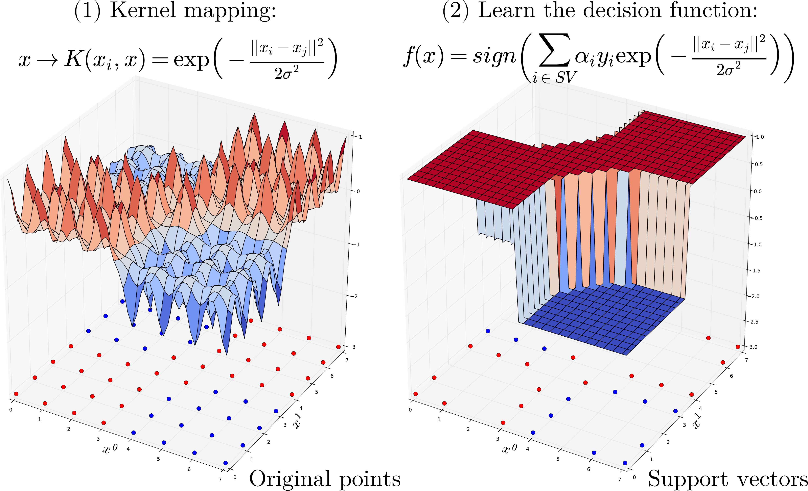

.. DO NOT EDIT.
.. THIS FILE WAS AUTOMATICALLY GENERATED BY SPHINX-GALLERY.
.. TO MAKE CHANGES, EDIT THE SOURCE PYTHON FILE:
.. "auto_gallery/kernel_svm.py"
.. LINE NUMBERS ARE GIVEN BELOW.

.. only:: html

    .. note::
        :class: sphx-glr-download-link-note

        :ref:`Go to the end <sphx_glr_download_auto_gallery_kernel_svm.py>`
        to download the full example code.

.. rst-class:: sphx-glr-example-title

.. _sphx_glr_auto_gallery_kernel_svm.py:

Non-Linear Kernel Methods and Support Vector Machines (SVM)
===========================================================

.. GENERATED FROM PYTHON SOURCE LINES 5-27

.. code-block:: Python

    import numpy as np
    import pandas as pd
    import seaborn as sns
    import matplotlib.pyplot as plt

    from sklearn.svm import SVC
    from sklearn.preprocessing import StandardScaler

    from sklearn import datasets
    from sklearn import metrics
    from sklearn.model_selection import train_test_split

    # Plot
    import matplotlib.pyplot as plt
    import seaborn as sns

    # Plot parameters
    plt.style.use('seaborn-v0_8-whitegrid')
    fig_w, fig_h = plt.rcParams.get('figure.figsize')
    plt.rcParams['figure.figsize'] = (fig_w, fig_h * .5)

.. GENERATED FROM PYTHON SOURCE LINES 28-47

Kernel algorithms
-----------------

Kernel Machine are based kernel methods require only a user-specified kernel function
:math:`K(x_i, x_j)`, i.e., a **similarity function** over pairs of data
points :math:`(x_i, x_j)` into kernel (dual) space on which learning
algorithms operate linearly, i.e. every operation on points is a linear
combination of :math:`K(x_i, x_j)`.
Outline of the SVM algorithm:

1. **Map points**  :math:`x` into **kernel space** using a **kernel function**:
   :math:`x \rightarrow K(x, .)`.
   Learning algorithms operates linearly by dot product into high-kernel
   space: :math:`K(., x_i) \cdot K(., x_j)`.
    - Using the kernel trick (Mercer’s Theorem) replaces dot product in high
      dimensional space by a simpler operation such that
      :math:`K(., x_i) \cdot K(., x_j) = K(x_i, x_j)`.
    - Thus we only need to compute a similarity measure :math:`K(x_i, x_j)` for each pairs of
      point and store in a :math:`N \times N` Gram matrix of.

.. GENERATED FROM PYTHON SOURCE LINES 50-65

SVM
---

2. **The learning process** consist of estimating the :math:`\alpha_i`
of the decision function that maximizes the hinge loss (of :math:`f(x)`)
plus some penalty when applied on all training points.

3. **Prediction** of a new point :math:`x` using the decision function.

.. math::

   f(x) = \text{sign} \left(\sum_i^N \alpha_i~y_i~K(x_i, x)\right).

.. GENERATED FROM PYTHON SOURCE LINES 68-87

Kernel function
---------------

One of the most commonly used kernel is the **Radial Basis Function (RBF) Kernel**.
For a pair of points :math:`x_i, x_j` the RBF kernel is defined as:

.. raw:: latex

   \begin{align}
      K(x_i, x_j) &= \exp\left(-\frac{\|x_i - x_j\|^2}{2\sigma^2}\right)\\
      &= \exp\left(-\gamma~\|x_i - x_j\|^2\right)
   \end{align}

Where :math:`\sigma` (or :math:`\gamma`)  defines the kernel width parameter.
Basically, we consider a Gaussian function centered on each training sample
:math:`x_i`.  it has a ready interpretation as a similarity measure as it
decreases with squared Euclidean distance between the two feature vectors.

Non linear SVM also exists for regression problems.

.. GENERATED FROM PYTHON SOURCE LINES 90-91

Dataset

.. GENERATED FROM PYTHON SOURCE LINES 91-96

.. code-block:: Python

    X, y = datasets.load_breast_cancer(return_X_y=True)
    X_train, X_test, y_train, y_test = \
        train_test_split(X, y, test_size=0.5, stratify=y, random_state=42)

.. GENERATED FROM PYTHON SOURCE LINES 97-98

Preprocessing: unequal variance of input features, requires scaling for svm.

.. GENERATED FROM PYTHON SOURCE LINES 98-107

.. code-block:: Python

    ax = sns.displot(x=X_train.std(axis=0), kind="kde", bw_adjust=.2, cut=0,
                     fill=True, height=3, aspect=1.5,)
    _ = ax.set_xlabels("Std-dev").tight_layout()

    scaler = StandardScaler()
    X_train = scaler.fit_transform(X_train)
    X_test = scaler.transform(X_test)

.. image-sg:: /auto_gallery/images/sphx_glr_kernel_svm_001.png
   :alt: kernel svm
   :srcset: /auto_gallery/images/sphx_glr_kernel_svm_001.png
   :class: sphx-glr-single-img

.. GENERATED FROM PYTHON SOURCE LINES 108-111

`Scikit-learn SVC <https://scikit-learn.org/stable/modules/generated/sklearn.svm.SVC.html>`_
(Support Vector Classification) with probalility function applying a logistic of
the decision_function

.. GENERATED FROM PYTHON SOURCE LINES 111-120

.. code-block:: Python

    svm = SVC(kernel='rbf', probability=True).fit(X_train, y_train)
    y_pred = svm.predict(X_test)
    y_score = svm.decision_function(X_test)
    y_prob = svm.predict_proba(X_test)[:, 1]

    ax = sns.relplot(x=y_score, y=y_prob, hue=y_pred, height=2, aspect=1.5)
    _ = ax.set_axis_labels("decision function", "Probability").tight_layout()

.. image-sg:: /auto_gallery/images/sphx_glr_kernel_svm_002.png
   :alt: kernel svm
   :srcset: /auto_gallery/images/sphx_glr_kernel_svm_002.png
   :class: sphx-glr-single-img

.. GENERATED FROM PYTHON SOURCE LINES 121-130

.. code-block:: Python

    print("bAcc: %.2f, AUC: %.2f (AUC with proba: %.2f)" % (
          metrics.balanced_accuracy_score(y_true=y_test, y_pred=y_pred),
          metrics.roc_auc_score(y_true=y_test, y_score=y_score),
          metrics.roc_auc_score(y_true=y_test, y_score=y_prob)))

    # Usefull internals: indices of support vectors within original X
    np.all(X_train[svm.support_, :] == svm.support_vectors_)

.. rst-class:: sphx-glr-script-out

 .. code-block:: none

    bAcc: 0.96, AUC: 0.99 (AUC with proba: 0.99)

    np.True_

.. rst-class:: sphx-glr-timing

   **Total running time of the script:** (0 minutes 0.490 seconds)

.. _sphx_glr_download_auto_gallery_kernel_svm.py:

.. only:: html

  .. container:: sphx-glr-footer sphx-glr-footer-example

    .. container:: sphx-glr-download sphx-glr-download-jupyter

      :download:`Download Jupyter notebook: kernel_svm.ipynb <kernel_svm.ipynb>`

    .. container:: sphx-glr-download sphx-glr-download-python

      :download:`Download Python source code: kernel_svm.py <kernel_svm.py>`

    .. container:: sphx-glr-download sphx-glr-download-zip

      :download:`Download zipped: kernel_svm.zip <kernel_svm.zip>`

.. only:: html

 .. rst-class:: sphx-glr-signature

    `Gallery generated by Sphinx-Gallery <https://sphinx-gallery.github.io>`_
