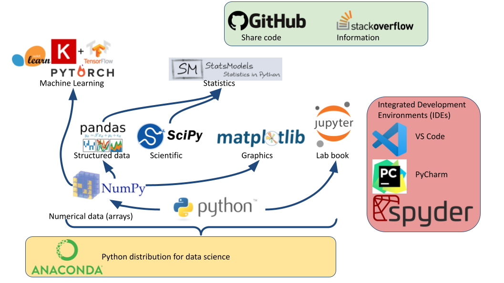

Python ecosystem for data-science
---------------------------------

.. RST https://thomas-cokelaer.info/tutorials/sphinx/rest_syntax.html

Integrated Development Environment: IDE
~~~~~~~~~~~~~~~~~~~~~~~~~~~~~~~~~~~~~~~

Software development environment that provide:
- Source-code editor (auto-completion, etc.).
- Execution facilities (interactive, etc.).
- Debugger.

Visual Studio Code (VS Code)
^^^^^^^^^^^^^^^^^^^^^^^^^^^^

`Installation <https://code.visualstudio.com/>`_. Tuto for `Linux <https://linuxhint.com/install-visual-studio-code-ubuntu22-04/>`_.

`VS Code for python <https://code.visualstudio.com/docs/python/python-quick-start#python-articles>`_

Extensions for data-science in python:

   - Python
   - Jupyter
   - IntellliCode
   - Python Indent
   - Python autoDocstring
   - Python Pylance
   - Path Intellisense

`Remote Development using SSH <https://code.visualstudio.com/docs/remote/ssh>`_

1. Setup ssh to hostname
2. Select Remote-SSH: Connect to Host... from the Command Palette (``F1, Ctrl+Shift+P``) and use the same user@hostname as in step 1
3. Remember hosts: (``F1, Ctrl+Shift+P``): Remote-SSH: Add New SSH Host or clicking on the Add New icon in the SSH Remote Explorer in the Activity Bar

Useful settings 

- Send Selection To Interactive Window (Settings / Jupyter Interactive Window Text Editor: Execute Selection)

Spyder
^^^^^^

- Syntax highlighting.
- Code introspection for code completion (use ``TAB``).
- Support for multiple Python consoles (including IPython).
- Explore and edit variables from a GUI.
- Debugging.
- Navigate in code (go to function definition) ``CTL``.

Shortcuts:
- ``F9`` run line/selection

Libraries
~~~~~~~~~

scipy.org: `<https://www.scipy.org/docs.html>`_

**Numpy**: Basic numerical operation. Matrix operation plus some basic solvers.::

        import numpy as np
        X = np.array([[1, 2], [3, 4]])
        #v = np.array([1, 2]).reshape((2, 1))
        v = np.array([1, 2])
        np.dot(X, v) # no broadcasting
        X * v # broadcasting
        np.dot(v, X)
        X - X.mean(axis=0)

**Scipy**: general scientific libraries with advanced solver::

        import scipy
        import scipy.linalg
        scipy.linalg.svd(X, full_matrices=False)

**Matplotlib**: visualization::

        import numpy as np
        import matplotlib.pyplot as plt
        #%matplotlib qt
        x = np.linspace(0, 10, 50)
        sinus = np.sin(x)
        plt.plot(x, sinus)
        plt.show()

**Pandas**: Manipulation of structured data (tables). input/output excel files, etc.

**Statsmodel**: Advanced statistics

**Scikit-learn**: Machine learning

.. http://truben.no/table/

+--------------+-----------------------------+----------------------+----------------+-------------------+--------------+-----------------+------------------+
|   library    | Arrays data, Num. comp, I/O | Structured data, I/O | Solvers: basic | Solvers: advanced | Stats: basic | Stats: advanced | Machine learning |
+==============+=============================+======================+================+===================+==============+=================+==================+
|    Numpy     |               X             |                      | X              |                   |              |                 |                  |
+--------------+-----------------------------+----------------------+----------------+-------------------+--------------+-----------------+------------------+
|    Scipy     |                             |                      | X              | X                 | X            |                 |                  |
+--------------+-----------------------------+----------------------+----------------+-------------------+--------------+-----------------+------------------+
|    Pandas    |                             |         X            |                |                   |              |                 |                  |
+--------------+-----------------------------+----------------------+----------------+-------------------+--------------+-----------------+------------------+
|  Statmodels  |                             |                      |                |                   | X            | X               |                  |
+--------------+-----------------------------+----------------------+----------------+-------------------+--------------+-----------------+------------------+
| Scikit-learn |                             |                      |                |                   |              |                 | X                |
+--------------+-----------------------------+----------------------+----------------+-------------------+--------------+-----------------+------------------+

Anaconda
~~~~~~~~

Anaconda is a python distribution that ships most of python tools and libraries.

**Installation**

1. Download anaconda (Python 3.x) http://continuum.io/downloads

2. Install it, on Linux
::

    bash Anaconda3-2.4.1-Linux-x86_64.sh

3. Add anaconda path in your PATH variable in your ``.bashrc`` file:
::

    export PATH="${HOME}/anaconda3/bin:$PATH"

**Managing with ``conda``**

Update conda package and environment manager to current version

::

    conda update conda

Install additional packages. Those commands install qt back-end (Fix a temporary issue to run spyder)

::

    conda install pyqt
    conda install PyOpenGL
    conda update --all

Install seaborn for graphics

::

    conda install seaborn
    # install a specific version from anaconda chanel
    conda install -c anaconda pyqt=4.11.4

List installed packages

::

    conda list

Search available packages

:: 

    conda search pyqt
    conda search scikit-learn

**Environments**

- A conda environment is a directory that contains a specific collection of conda packages that you have installed.
- Control packages environment for a specific purpose: collaborating with someone else, delivering an application to your client, 
- Switch between environments

List of all environments

::
    conda info --envs

1. Create new environment
2. Activate
3. Install new package

::

    conda create --name test
    # Or
    conda env create -f environment.yml
    source activate test
    conda info --envs
    conda list
    conda search -f numpy
    conda install numpy

**Miniconda**

Anaconda without the collection of (>700) packages.
With Miniconda you download only the packages you want with the conda command: ``conda install PACKAGENAME``

1. Download anaconda (Python 3.x) https://conda.io/miniconda.html

2. Install it, on Linux

::

    bash Miniconda3-latest-Linux-x86_64.sh

3. Add anaconda path in your PATH variable in your ``.bashrc`` file:

::

    export PATH=${HOME}/miniconda3/bin:$PATH

4. Install required packages

::

        conda install -y scipy
        conda install -y pandas
        conda install -y matplotlib
        conda install -y statsmodels
        conda install -y scikit-learn
        conda install -y sqlite
        conda install -y spyder
        conda install -y jupyter

Additional packages with pip
~~~~~~~~~~~~~~~~~~~~~~~~~~~~

**pip** alternative for packages management (update ``-U`` in user directory ``--user``):

::

    pip install -U --user seaborn

For neuroimaging:

::

    pip install -U --user nibabel
    pip install -U --user nilearn