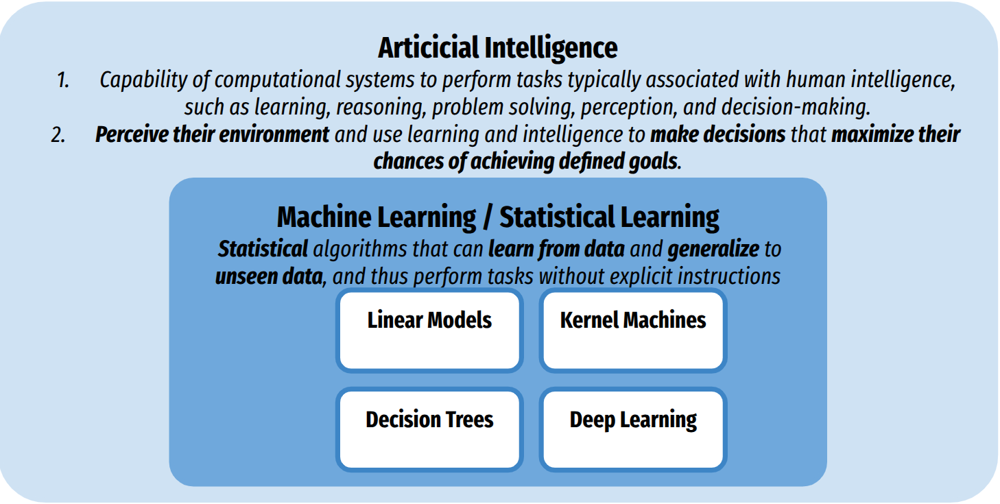
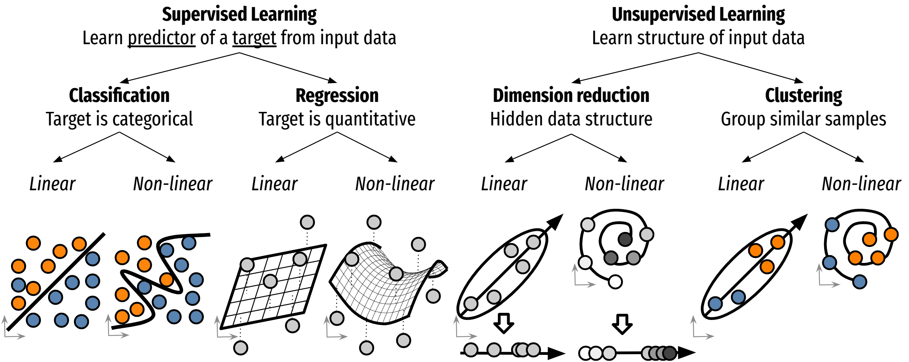

Introduction
------------

Artificial Intelligence & Machine Learning
~~~~~~~~~~~~~~~~~~~~~~~~~~~~~~~~~~~~~~~~~~

**Machine learning is a branch of artificial intelligence (AI)** focused on developing algorithms and models that enable computers to **learn patterns** and make data-based decisions. Instead of being explicitly programmed to perform a task, a machine learning system improves its performance through experience by analyzing data and recognizing patterns.

  

In machine learning, a **model is a mathematical representation** of the data using set **parameters**. An **estimator** refers to any algorithm that learns or estimates the parameters from data, i.e., fitting the model to the data.

Machine learning models can **linear or non-linear**, `see ML map <https://scikit-learn.org/1.3/tutorial/machine_learning_map>`_.
Machine learning can adress various type of problems, including:

Typology of Machine Learning Problems
~~~~~~~~~~~~~~~~~~~~~~~~~~~~~~~~~~~~~

1. `Supervised learning <https://en.wikipedia.org/wiki/Supervised_learning>`_ Learn a function to predict output or target *y* given input *X*.
    a. **Regression** problems: *y* is quantitative.
    b. **Classification** problems *y* is qualitative/categorical, i.e., (labels).

2. `Unsupervised learning <https://en.wikipedia.org/wiki/Unsupervised_learning>`_: Learn the hidden structure of the data *X*
    a. **Dimensionality reduction** (or feature extraction) in machine learning refers to techniques that reduce the number of input variables or features in a dataset while preserving essential information and exploiting redundant or irrelevant features. It can be helpful for visualization or analysis of high-dimension data.
    b. **Clustering** groups similar data points together based on their features. It helps identify patterns or structures within the data by organizing it into clusters, where points within the same cluster are more similar to each other than to those in different clusters.

  
Simplified Typology of Machine Leaning Algorithms
~~~~~~~~~~~~~~~~~~~~~~~~~~~~~~~~~~~~~~~~~~~~~~~~~

**Linear Models** (scikit-learn)

- Output is a Linear combination of input features: (One neuron)
- Domains: Tabular data, basic computer vision (with feature extraction) and NLP
- Robust to overfit but limited power, requires few samples (>100)

**Kernel Machine (Linear or non-linear)** (scikit-learn)

- Output is a Linear combination of input samples
- Domains: Tabular data, basic computer vision (with feature extraction) and NLP
- Requires limited samples (>500)

**Decision Tree  (non-linear)** (scikit-learn)

- Output is a Linear combination of input samples
- Domains: Tabular data, basic computer vision (with feature extraction) and NLP
- Requires limited samples (>500)

**Deep Learning (Non Linear)** (Pytorch or TensorFlow with scikit-learn)

- Stack layers of neurons
- Domains: Computer vision, NLP
- Powerful, requires limited very large sample size samples (>1000)

